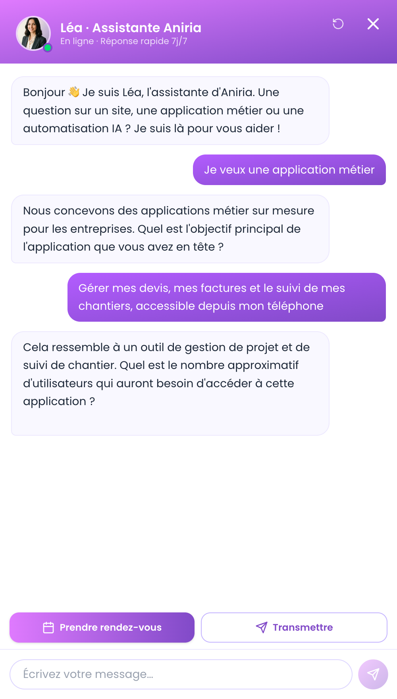

# Léa — Resilient Multi-Provider LLM Agent

A production conversational agent running 24/7 on a live commercial website
([aniria.dev](https://aniria.dev)). Léa qualifies inbound leads, calls tools to
surface contextual UI, and escalates structured project briefs by email — all on
top of a **zero-cost, four-provider LLM fallback chain** designed to stay up even
when individual inference providers rate-limit or fail.

<p align="center">
  
  <br>
  <em>Léa live on aniria.dev — qualifying a lead, then calling a tool to surface the booking CTAs.</em>
</p>

> This repository contains the real source of the Léa agent, extracted from the
> [aniria.dev](https://aniria.dev) Next.js app. The provider chain lives in
> [`src/app/api/agent/route.ts`](src/app/api/agent/route.ts); the chat widget,
> lead escalation, AI summarization, and helpers are under [`src/`](src/).
> API keys live in environment variables and are never committed.

---

## Why this exists

Running an LLM in production on a bootstrapped budget means two problems collide:
free inference tiers are unreliable (rate limits, cold failures), and a chatbot
that returns an error to a prospect is worse than no chatbot at all.

Léa solves both with **architecture rather than spend**: a provider chain that
fails over silently, and graceful degradation that never leaves a visitor stuck —
if every model is down, the agent opens the contact/booking buttons instead of
showing an error.

---

## Architecture

```
Visitor (ChatWidget) ──POST /api/agent { messages:[...] }──▶ Route Handler (Node runtime)
                                                                  │
                              buildChain() — only providers with a key
                                                                  ▼
        ┌─────────────  Groq        · llama-3.3-70b      ─┐
        │               Cerebras    · gpt-oss-120b        │  first success wins
        │               OpenRouter  · gpt-oss-120b:free   │
        └─────────────  Gemini      · 2.5-flash-lite     ─┘  (native Gemini format)
                                                                  │
                                  all providers down? ──▶ graceful degradation:
                                                          emit show_cta → open
                                                          booking / contact buttons
```

| Layer          | Tech                                                       |
| -------------- | ---------------------------------------------------------- |
| Framework      | Next.js 16 (App Router), React 19, TypeScript              |
| Agent backend  | Route Handler `api/agent` — `runtime = "nodejs"`           |
| Front          | `ChatWidget.tsx` — client component, ~350 LOC              |
| LLM access     | Native `fetch` to each API — no SDK, zero LLM deps         |
| Escalation     | Resend (transactional email)                               |
| Hosting        | Serverless (Vercel)                                        |

---

## Engineering highlights

### 1. Zero-cost multi-provider fallback

The chain stacks four free inference tiers: **Groq → Cerebras → OpenRouter →
Gemini**. If one rate-limits (429) or fails, the request transparently moves to
the next. `buildChain()` auto-skips any provider whose key is absent, so adding a
provider is "set its key, nothing else."

### 2. One interface, two API formats

Two transport functions — `callOpenAICompat()` (Groq / Cerebras / OpenRouter) and
`callGemini()` (Google's native schema) — are unified behind a single
`ProviderResult` type. The chain logic doesn't know or care which format a
provider speaks.

### 3. Selective retry

Two attempts with a 400 ms backoff **only on 5xx** (transient server errors). A
4xx/429 skips straight to the next provider — no point retrying a request the
provider has already refused. Failure modes are treated differently on purpose.

### 4. Graceful degradation, end to end

Every LLM down → instead of an error, the agent emits `show_cta` and the front
opens the booking / contact buttons. The same philosophy applies to the lead
summary: if the summarization model fails, it falls back to the raw transcript.
**The visitor is never blocked.**

---

## Agent capabilities

- **Lead qualification** — asks one question at a time (project type, goal, scope,
  timeline), prompt-driven.
- **Tool calling** — a single `afficher_options_contact` tool. When the need is
  qualified, the model calls it and the front renders real "Book a call" / "Send
  my project" buttons (the model never invents buttons in free text).
- **Anti-hallucination guardrail** — the agent is forbidden from proposing any
  date or time; a dedicated calendar owns booking. It never books on its own.
- **Escalation** — a server action sends a structured, AI-summarized brief by
  email (Groq Llama, temperature 0.2, bulleted output), with a raw-transcript
  fallback if summarization fails.

---

## State & memory

Stateless on the server: the full `messages[]` history is sent each turn.
Client-side, the conversation is persisted in `sessionStorage` so it survives a
refresh — no database, no session store.

---

## Status

In production on [aniria.dev](https://aniria.dev) — the chat widget, bottom-right.

---

## Source

These are the Léa feature files, lifted from the aniria.dev Next.js app:

| File | Role |
| --- | --- |
| [`src/app/api/agent/route.ts`](src/app/api/agent/route.ts) | The agent backend — system prompt, tool definition, the four-provider fallback chain, graceful degradation |
| [`src/components/site/ChatWidget.tsx`](src/components/site/ChatWidget.tsx) | The chat widget — `sessionStorage` memory, tool-driven CTA buttons, booking/project forms |
| [`src/app/agent/page.tsx`](src/app/agent/page.tsx) | Full-page `/agent` route |
| [`src/app/actions/leads.ts`](src/app/actions/leads.ts) | Lead escalation — Resend email for bookings and project briefs |
| [`src/lib/summarize.ts`](src/lib/summarize.ts) | AI summarization of the visitor exchange into a bulleted brief |
| [`src/lib/availability.ts`](src/lib/availability.ts) | File-as-source-of-truth booking slots (no DB) |
| [`src/lib/phone.ts`](src/lib/phone.ts) | Phone validation / `wa.me` normalization |

> Extracted feature code — it depends on the host Next.js app (the `@/` path
> alias, Tailwind, Resend) and isn't meant to build standalone.

---

Built and maintained by Raphaël Leroy ([ANIRIA](https://aniria.dev)).
